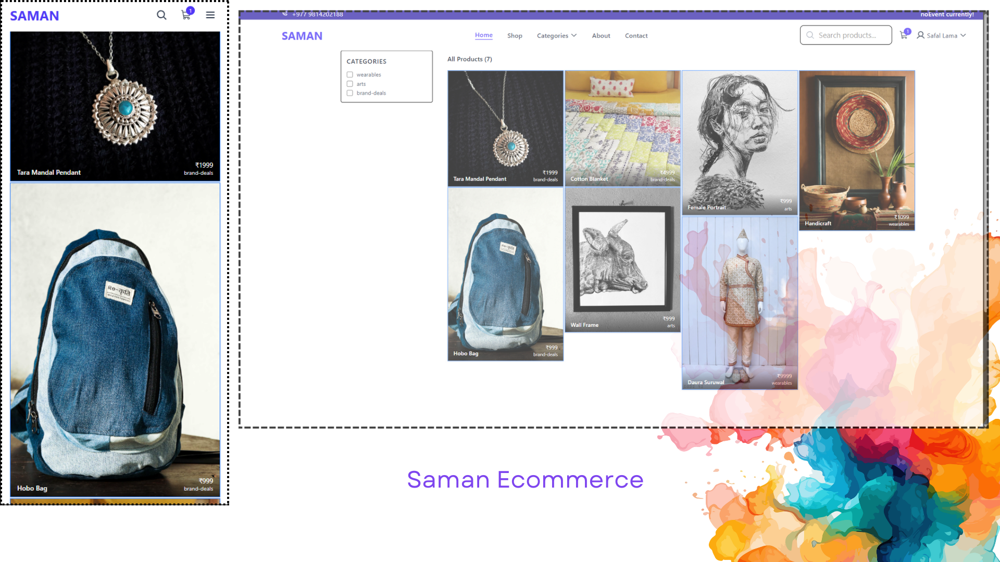

# Saman Ecommerce 

https://github.com/user-attachments/assets/121a11ce-ef7b-4939-bdef-1f649749638e

<table>
  <tr>
    <td>

    </td>
    <td>
Saman Ecommerce is a general eCommerce platform built using the MERN stack (MongoDB, Express.js, React.js, and Node.js). It provides basic functionalities for managing products and users.
    </td>
  </tr>
</table>

## Features

- **Authentication:** Login and register system. Admin accounts must be created manually.
- **Admin Control:**  
  - Full CRUD (Create, Read, Update, Delete) operations for products.  
  - Create and read operations for user accounts.  
- **User Capabilities:**  
  - Browse products and place orders.  
  - Filter and search for products.  
- **Order System:** Users can make an order, but checkout functionality is not implemented.  

## Missing eCommerce Features  

Due to limitations specific to Nepal, the platform does not include an online payment system.  
